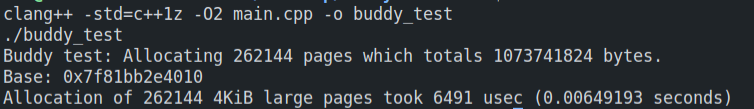

# C++ Buddy allocator

Benchmark results:

- Allocated `262144` 4kib large pages (1GiB worth of memory)
- Results lie between `0.28` and `0.31` seconds on my `Intel Core i5-4210U`, `12GB` ram.
- Benchmark results may vary based on your hardware and OSes availability.

 

## Benchmark image:

